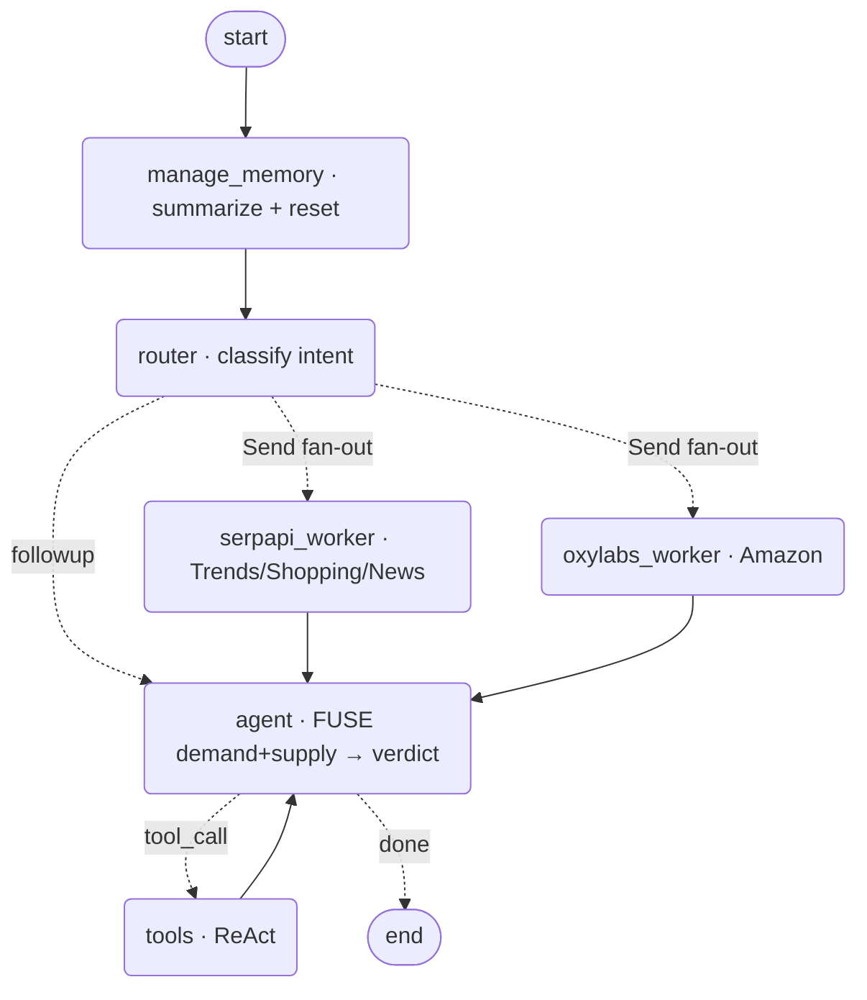

# LaunchLens 🔭

**An AI market-intelligence agent that tells a founder whether a product is worth launching.**

A founder types a product idea in plain English. LaunchLens researches it **live**,
**fusing two worlds** — *demand* (Google Trends / Shopping / News via **SerpApi**) with
*supply* (Amazon search / product / pricing / bestsellers via **Oxylabs**) — and replies
with a **Go / No-Go / Niche** verdict covering demand, price band, and positioning. Then
it keeps chatting, with memory of the conversation.

> Oxylabs tells you *what's selling*. SerpApi tells you *what the market wants*.
> LaunchLens connects them — that fusion is the whole product.

Built on **LangGraph** · Python 3.12 · provider-agnostic LLM (OpenAI or Claude) ·
**Redis** checkpointer · CLI + (bonus) FastAPI streaming API + React UI.

---

## Architecture



Every turn: **manage memory** (summarize if long) → **route** by intent → **fan out**
research across individual engines in parallel → **agent fuses** both sides into the verdict.
Follow-ups skip research and answer from memory, calling tools on demand.

---

## The 5 required LangGraph concepts → exact location

| # | Concept | Where it lives (file · function · line) |
|---|---------|------------------------------------------|
| 1 | **Graph construction & typed state + reducers** | `backend/src/launchlens/state.py:25` `LaunchLensState`; custom reducer `state.py:18` `reset_or_extend`, messages reducer `state.py:27`; wiring & compile `backend/src/launchlens/graph.py:21` `build_graph` |
| 2 | **Fan-out (parallel) + merge** | `backend/src/launchlens/nodes.py:152` `route_research` (returns a list of `Send`); parallel workers `nodes.py:180` `serpapi_worker` / `nodes.py:191` `oxylabs_worker`; merge via reducer `state.py:36`; edges `graph.py:37` |
| 3 | **Routing (conditional edges)** | `backend/src/launchlens/nodes.py:128` `router` (LLM intent classification → `Routing`); conditional edge `nodes.py:152` `route_research` wired at `graph.py:37` |
| 4 | **Agent node + tools** | `backend/src/launchlens/nodes.py:241` `agent` (binds tools, fuses demand+supply); ReAct loop `nodes.py:247` `should_continue` + `graph.py:44`; tools `backend/src/launchlens/tools.py:366` `ALL_TOOLS` (e.g. `tools.py:312` `trend_demand`) — all return **slim JSON** |
| 5 | **Short-term memory (checkpointer + summarization)** | checkpointer `backend/src/launchlens/memory.py:21` `get_checkpointer` (Redis → SQLite fallback); summarization node `backend/src/launchlens/nodes.py:74` `manage_memory` (RemoveMessage prune) |

---

## Data integration (demand × supply, fused)

**Demand — SerpApi** (3 engines): `google_trends` (interest direction + hot related
queries), `google_shopping` (cross-retailer price band), `google_news` (launches/recalls).
**Supply — Oxylabs** (4 sources): `amazon_search`, `amazon_product` (with review-gap
mining), `amazon_bestsellers`, `amazon_pricing`.

Tools live in `backend/src/launchlens/tools.py` and return **slimmed JSON**, never raw
scrapes (token discipline). The `agent` node is explicitly prompted to fuse both sides
into one verdict — `nodes.py:203` `AGENT_PROMPT`.

---

## Setup

Requirements: [uv](https://docs.astral.sh/uv/), Node 18+, and API keys.

```bash
# 1. Keys
cp .env.example .env        # fill in OPENAI_API_KEY, SERPAPI_API_KEY, OXYLABS_*, REDIS_URI

# 2. Backend env (Python 3.12, installs the launchlens package editable)
uv sync --extra api

# 3. Frontend deps (bonus UI)
cd frontend && npm install && cd ..
```

### `.env`

```ini
LLM_MODEL=openai:gpt-4o-mini          # or anthropic:claude-haiku-4-5-20251001 (+ ANTHROPIC_API_KEY)
OPENAI_API_KEY=...
SERPAPI_API_KEY=...
OXYLABS_USERNAME=...
OXYLABS_PASSWORD=...
AMAZON_DOMAIN=in
REDIS_URI=redis://default:<pw>@<host>:<port>   # Redis Cloud or local; empty → SQLite fallback
MAX_MESSAGES=12
KEEP_LAST=6
```

---

## Run

```bash
# CLI (the graded core)
uv run python main.py

# Bonus: API (SSE streaming) + React UI
uv run uvicorn launchlens.api.app:app --port 8010      # terminal 1
cd frontend && npm run dev                              # terminal 2 → http://localhost:5173
```

CLI commands: `/market <code>`, `/markets`, `/state`, `/new`, `/help`, `/quit`.

---

## Demo script (shows memory across turns)

1. `Should I launch a stainless-steel insulated water bottle in India under ₹1,500?`
   → full fan-out + a **Go/No-Go/Niche** verdict.
2. `What about the US market?` → recalls the idea, re-researches `com`.
3. `Pull the reviews of the top-selling one and name the main complaint.`
   → agent **tool loop** (calls `amazon_product`).
4. `Where would a ₹1,299 price sit vs competitors?` → pricing fusion.
5. Keep chatting until the thread passes 12 messages → the **summarization node** fires
   (`/state` shows the running summary).
6. **Quit and relaunch** (`uv run python main.py`), same thread, ask
   `What did we decide about the bottle?` → full recall from **Redis** (the checkpointer).

---

## Project structure

```
backend/src/launchlens/   config.py llm.py state.py nodes.py graph.py memory.py tools.py
                          clients/{serpapi,oxylabs}.py   api/app.py (FastAPI)
frontend/                 Vite + React chat UI (streaming, verdict cards, research rail)
cli.py  main.py           entry points (repo root)
docs/graph.mmd            mermaid diagram (graph.get_graph().draw_mermaid())
reference/                worked example (marketpulse) — reference only
```

## Notes

- **Live by default** (no cache, no fixtures): SerpApi + Oxylabs + the LLM all run live.
- **Provider-agnostic LLM** via `init_chat_model` — switch OpenAI↔Claude with one env var.
- **Redis checkpointer** with an automatic **SQLite fallback** if Redis is unreachable,
  so the project always runs.

## Demo video

📹 _<add Loom/YouTube link here>_

## Author

shivani
