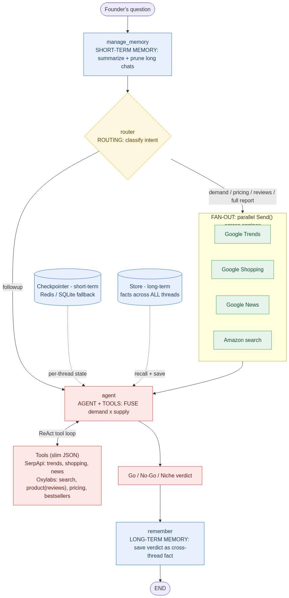
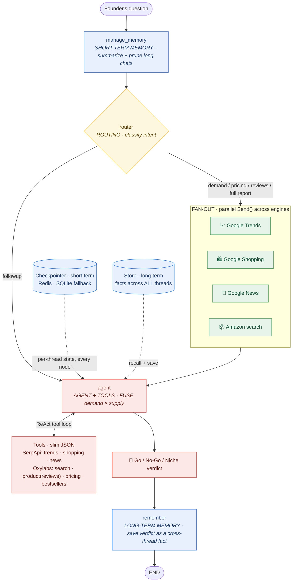

# LaunchLens 🔭

**An AI market-intelligence agent that tells a founder whether a product is worth launching.**

A founder types a product idea in plain English. LaunchLens researches it **live**,
**fusing two worlds** — *demand* (Google Trends / Shopping / News via **SerpApi**) with
*supply* (Amazon search / product / pricing / bestsellers via **Oxylabs**) — and replies
with a **Go / No-Go / Niche** verdict covering demand, price band, and positioning. Then
it keeps chatting, with memory of the conversation.

> Oxylabs tells you *what's selling*. SerpApi tells you *what the market wants*.
> LaunchLens connects them — that fusion is the whole product.

Built on **LangGraph** · Python 3.12 · provider-agnostic LLM (OpenAI or Claude) ·
**Redis** checkpointer · CLI + (bonus) FastAPI streaming API + React UI.

---

## Architecture



> Diagrams of the **same** graph: **`graph_out/graph_compiled.png`** is generated straight
> from the live graph (`graph.get_graph().draw_mermaid_png()`); **`graph_out/graph_styled.png`**
> (above) is the hand-styled, colour-by-concept version; **`graph_out/launchlens_architecture.drawio`**
> is an editable draw.io version (open at draw.io → Export → PNG/PDF). Mermaid sources: `graph_out/*.mmd`.
> The colourised mermaid is also inlined below so it renders on GitHub.



Every turn: **manage memory** (summarize if long) → **route** by intent → **fan out**
research across individual engines in parallel → **agent fuses** both sides, mining real
Amazon reviews for the differentiation angle, into the verdict. Follow-ups skip research
and answer from memory, calling tools on demand.

### Data sources used (live)

| Side | Provider | Used | Produces |
|------|----------|------|----------|
| Demand | SerpApi | `google_trends`, `google_shopping`, `google_news` (3 of 4) | trend direction + related queries, cross-retailer price band, recalls/launches |
| Supply | Oxylabs | `amazon_search`, `amazon_product` (reviews), `amazon_pricing`, `amazon_bestsellers` (4 of 5) | top sellers, prices, ratings, **review-gap mining**, competing offers |

Requirement is ≥2 each; we ship 3 + 4. `google_search` and Oxylabs `universal` are
intentionally not used (not needed for the verdict).

### How this scales

- **Stateless app, state in the DB:** all conversation state lives in the checkpointer
  (Redis Cloud), keyed by `thread_id` — the process holds no memory, so you can run
  many backend replicas behind a load balancer.
- **No global mutable state:** the marketplace/domain is passed explicitly through each
  tool call (not a global), so concurrent users on different markets never collide.
- **Bounded context:** the summarization node caps token growth on long threads.
- **Config via env:** keys, model, market, and Redis URI are all env-driven; swap the
  LLM (OpenAI↔Claude) or the checkpointer (Redis↔SQLite↔Postgres) with no code change.
- **Token discipline:** every tool returns slim JSON, never raw scrapes.
- **Resilience & cost:** every external node (workers, agent, tools) retries transient
  failures with **exponential backoff** (`graph.py` `RETRY`); provider responses are
  **cached** on disk with a TTL (`cache.py`) to spare the SerpApi free tier / Oxylabs credits.

### Memory: short-term (required) + long-term (bonus) — both implemented

- **Short-term (required concept 5):** a **checkpointer** (`memory.py:21` `get_checkpointer`,
  Redis → SQLite fallback) that survives restarts, keyed by `thread_id`, plus a
  **summarization node** (`nodes.py` `manage_memory`).
- **Long-term (bonus): a LangGraph `Store`** (`memory.py:44` `get_store`, Redis-backed)
  holding **facts across ALL threads** — launch verdicts and the founder's name/location.
  The `agent` reads prior verdicts (`nodes.py:316` `_recall_facts`) and the profile
  (`nodes.py:328` `_recall_profile`); the **`remember`** node (`nodes.py:365`) writes them.
  Verified: a verdict/profile from one thread is recalled in a brand-new thread.

---

## The 5 required LangGraph concepts → exact location

| # | Concept | Where it lives (file · function · line) |
|---|---------|------------------------------------------|
| 1 | **Graph construction & typed state + reducers** | `backend/src/launchlens/state.py:25` `LaunchLensState`; custom reducer `state.py:18` `reset_or_extend`, messages reducer `state.py:27`, transcript reducer `state.py:43`; wiring & compile `backend/src/launchlens/graph.py:33` `build_graph` |
| 2 | **Fan-out (parallel) + merge** | `backend/src/launchlens/nodes.py:196` `route_research` (returns a list of `Send`); **four parallel branch nodes** `nodes.py:233` `pull_trends`, `nodes.py:238` `pull_shopping`, `nodes.py:243` `pull_news`, `nodes.py:248` `pull_amazon` (all run in one super-step → merge at `agent`); merge via reducer `state.py:39`; edges in `graph.py:33` `build_graph` (lines 61-65) |
| 3 | **Routing (conditional edges)** | `backend/src/launchlens/nodes.py:156` `router` (LLM intent classification → `Routing` at `nodes.py:106`); conditional edge `nodes.py:196` `route_research` (intent → branches, with `chitchat`/`followup` default to the agent) wired in `graph.py:61` |
| 4 | **Agent node + tools** | `backend/src/launchlens/nodes.py:351` `agent` (binds tools, fuses demand+supply); ReAct loop `nodes.py:357` `should_continue` + `graph.py:67`; tools `backend/src/launchlens/tools.py:368` `ALL_TOOLS` (e.g. `tools.py:314` `trend_demand`), wrapped by `safe` at `tools.py:27` — all return **slim JSON** |
| 5 | **Short-term memory (checkpointer + summarization)** | checkpointer `backend/src/launchlens/memory.py:21` `get_checkpointer` (Redis → SQLite fallback); summarization node `backend/src/launchlens/nodes.py:79` `manage_memory` (RemoveMessage prune, cuts on a human boundary) |
| ★ | **Bonus — long-term, cross-thread memory (`Store`)** | `backend/src/launchlens/memory.py:44` `get_store` (Redis Store); read `nodes.py:316` `_recall_facts` + `nodes.py:328` `_recall_profile`; write `nodes.py:365` `remember` |

---

## Data integration (demand × supply, fused)

**Demand — SerpApi** (3 engines): `google_trends` (interest direction + hot related
queries), `google_shopping` (cross-retailer price band), `google_news` (launches/recalls).
**Supply — Oxylabs** (4 sources): `amazon_search`, `amazon_product` (with review-gap
mining), `amazon_bestsellers`, `amazon_pricing`.

Tools live in `backend/src/launchlens/tools.py` and return **slimmed JSON**, never raw
scrapes (token discipline). The `agent` node is explicitly prompted to fuse both sides
into one verdict (`nodes.py:254` `AGENT_PROMPT`).

---

## Setup

Requirements: [uv](https://docs.astral.sh/uv/), Node 18+, and API keys.

```bash
# 1. Keys
cp .env.example .env        # fill in OPENAI_API_KEY, SERPAPI_API_KEY, OXYLABS_*, REDIS_URI

# 2. Backend env (Python 3.12, installs the launchlens package editable)
uv sync --extra api

# 3. Frontend deps (bonus UI)
cd frontend && npm install && cd ..
```

### `.env`

```ini
LLM_MODEL=openai:gpt-4o-mini          # or anthropic:claude-haiku-4-5-20251001 (+ ANTHROPIC_API_KEY)
OPENAI_API_KEY=...
SERPAPI_API_KEY=...
OXYLABS_USERNAME=...
OXYLABS_PASSWORD=...
AMAZON_DOMAIN=in
REDIS_URI=redis://default:<pw>@<host>:<port>   # Redis Cloud or local; empty → SQLite fallback
MAX_MESSAGES=12
KEEP_LAST=6
```

---

## Run

```bash
# CLI (the graded core)
uv run python main.py

# Bonus: API (SSE streaming) + React UI
uv run uvicorn launchlens.api.app:app --port 8010      # terminal 1
cd frontend && npm run dev                              # terminal 2 → http://localhost:5173
```

CLI commands: `/market <code>`, `/markets`, `/state`, `/new`, `/help`, `/quit`.

---

## Demo script (shows memory across turns)

1. `Should I launch a stainless-steel insulated water bottle in India under ₹1,500?`
   → full fan-out + a **Go/No-Go/Niche** verdict.
2. `What about the US market?` → recalls the idea, re-researches `com`.
3. `Pull the reviews of the top-selling one and name the main complaint.`
   → agent **tool loop** (calls `amazon_product`).
4. `Where would a ₹1,299 price sit vs competitors?` → pricing fusion.
5. Keep chatting until the thread passes 12 messages → the **summarization node** fires
   (`/state` shows the running summary).
6. **Quit and relaunch** (`uv run python main.py`), same thread, ask
   `What did we decide about the bottle?` → full recall from **Redis** (the checkpointer).

---

## Project structure

```
backend/src/launchlens/   config.py llm.py state.py nodes.py graph.py memory.py tools.py
                          clients/{serpapi,oxylabs}.py   api/app.py (FastAPI)
frontend/                 Vite + React chat UI (streaming, verdict cards, research rail)
cli.py  main.py           entry points (repo root)
docs/graph.mmd            mermaid diagram (graph.get_graph().draw_mermaid())
reference/                worked example (marketpulse) — reference only
```

## Notes

- **Live by default** (no cache, no fixtures): SerpApi + Oxylabs + the LLM all run live.
- **Provider-agnostic LLM** via `init_chat_model` — switch OpenAI↔Claude with one env var.
- **Redis checkpointer** with an automatic **SQLite fallback** if Redis is unreachable,
  so the project always runs.

## Demo video

📹 _<add Loom/YouTube link here>_

## Author

shivani
